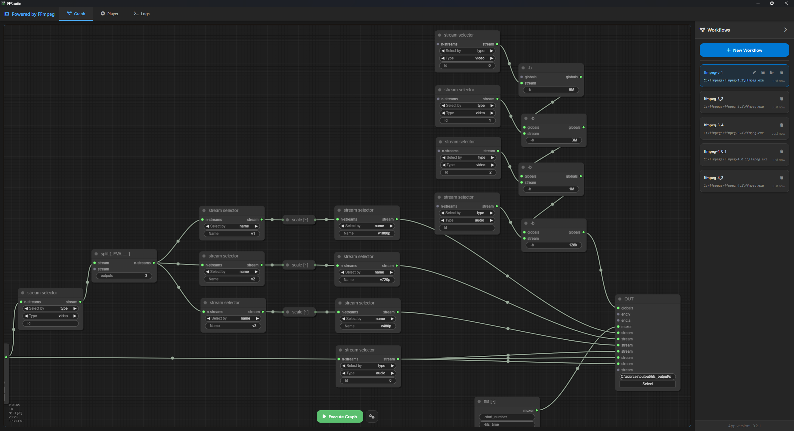

# FFStudio

**FFStudio** is a modern, cross-platform desktop application for visually designing, executing, and managing complex FFmpeg video/audio processing workflows. It provides a graphical interface to build, preview, and run FFmpeg command pipelines using a node-based editor, timeline, and integrated player.



---

## Table of Contents

- [Features](#features)
- [App Overview](#app-overview)
- [User Workflow](#user-workflow)
- [Technology Stack](#technology-stack)
- [Getting Started](#getting-started)
- [Project Structure](#project-structure)
- [License](#license)

---

## Features

- **Visual Workflow Editor:** Drag-and-drop node-based editor using LiteGraph.js to construct FFmpeg processing graphs with automatic node generation from FFmpeg binary.
- **Workflow Management:** Create, edit, save, and delete reusable workflows, each with its own FFmpeg path, environment variables, and description.
- **Advanced Player System:** 
  - **Timeline Preview:** Visual timeline with segment management and frame-accurate seeking
  - **Stream Player:** Support for HLS (.m3u8) and DASH (.mpd) streaming protocols with quality selection
  - **Compare View:** Side-by-side video comparison with offset controls and synchronized playback
- **Pro Mode:** Advanced execution pipeline with canvas chain visualization for complex multi-step workflows.
- **Real-time Preview:** Generate preview frames and segments from your workflow graphs with caching system.
- **Execution Logs:** Comprehensive logging system with export functionality for FFmpeg execution, errors, and workflow actions.
- **Cross-Platform:** Built with Tauri 2.0 (Rust + Web), runs on Windows, macOS, and Linux.
- **FFmpeg Integration:** Auto-discovers and parses FFmpeg features, codecs, filters, muxers, demuxers, and options from your installed binary.
- **Environment Variables:** Set custom environment variables per workflow for different FFmpeg configurations.
- **File Server:** Built-in HTTP server for serving media files and previews.
- **Responsive UI:** Modern, responsive interface with collapsible sidebar and tabbed navigation.

---

## App Overview

FFStudio is designed to make advanced FFmpeg usage accessible and visual. Instead of writing complex command lines, users can:

- **Build processing pipelines** by connecting nodes representing inputs, filters, codecs, and outputs.
- **Manage multiple workflows** for different tasks (compression, extraction, conversion, etc.).
- **Preview and fine-tune** segments using a timeline and player.
- **Execute and monitor** FFmpeg jobs with real-time feedback and logs.

### Main UI Areas

- **Top Bar:** App title, tab navigation (Graph, Player, Logs).
- **Main Area:**
  - **Graph:** Node-based editor for building FFmpeg graphs.
  - **Player:** Video/audio player with timeline and segment controls.
  - **Logs:** Execution and debug logs.
- **Right Sidebar:** Workflow management (list, add, edit, delete, select, execute).
- **Modals:** For workflow creation/editing and loading/progress feedback.

---

## User Workflow

1. **Create a Workflow:**
   - Click "New Workflow" in the sidebar.
   - Enter a name, FFmpeg binary path, optional environment variables, and description.
   - FFStudio parses the FFmpeg binary and auto-generates available nodes (filters, codecs, etc.).

2. **Build a Processing Graph:**
   - Drag nodes (inputs, filters, codecs, outputs) onto the canvas.
   - Connect nodes to define the processing pipeline.
   - Configure node properties (e.g., filter parameters, codec options).

3. **Select and Edit Workflows:**
   - Switch between workflows using the sidebar.
   - Edit or delete workflows as needed.

4. **Preview and Edit Segments:**
   - Use the timeline to select, label, and manage video/audio segments.
   - Preview segments in the integrated player.

5. **Execute the Graph:**
   - Click "Execute Graph" to run the FFmpeg pipeline.
   - Monitor progress and logs in real time.
   - Cancel or stop processing if needed.

6. **Review Logs:**
   - View detailed logs for each execution.
   - Export logs for troubleshooting or record-keeping.

---

## Technology Stack

- **Frontend:** 
  - Vanilla JavaScript (ES6 modules)
  - HTML5, CSS3 with custom responsive design
  - [LiteGraph.js](https://github.com/jagenjo/litegraph.js) for node-based graph editor
  - [Video.js](https://videojs.com/) for advanced video playback
  - FontAwesome 6.4.0 for icons
- **Backend:** 
  - [Tauri 2.0](https://tauri.app/) (Rust) with modern plugin system
  - Tauri plugins: file system, dialogs, opener, clipboard
  - Built-in HTTP server for media streaming
  - Process management and FFmpeg execution
- **FFmpeg Integration:** 
  - User-supplied binary with automatic feature discovery
  - Real-time parsing of codecs, filters, muxers, demuxers
  - Environment variable support per workflow
- **Cross-Platform:** Windows, macOS, Linux with native performance

---

## Getting Started

### Prerequisites

- [Rust](https://www.rust-lang.org/tools/install) (latest stable version)
- [Tauri CLI](https://tauri.app/v1/guides/getting-started/prerequisites) (`cargo install tauri-cli`)
- [FFmpeg](https://ffmpeg.org/) binary installed on your system
- Git (for cloning the repository)

### Installation

1. **Clone the repository:**
   ```sh
   git clone https://github.com/yourusername/ff-studio-src.git
   cd ff-studio-src
   ```

2. **Install dependencies:**
   ```sh
   # Install Rust (if not already installed)
   curl --proto '=https' --tlsv1.2 -sSf https://sh.rustup.rs | sh
   
   # Install Tauri CLI
   cargo install tauri-cli
   
   # Build the application
   cd src-tauri
   cargo build
   cd ..
   ```

3. **Run the app:**
   ```sh
   # Development mode (from project root)
   tauri dev
   
   # Or build and run release version
   tauri build
   ```

### Usage

- On first launch, create a new workflow and specify your FFmpeg binary path.
- Build your processing graph visually using the node editor.
- Use the timeline and player to preview and fine-tune segments.
- Execute and monitor your workflow with real-time logs.

### Advanced Features

#### Pro Mode
- **Canvas Chain Visualization:** Advanced execution pipeline view for complex multi-step workflows
- **Pipeline Management:** Add, remove, and refresh chain elements
- **Visual Workflow Debugging:** See your entire processing pipeline at a glance

#### Multi-Player System
- **Timeline Preview:** Frame-accurate video preview with segment management
- **Stream Player:** Support for HLS (.m3u8) and DASH (.mpd) streaming protocols
- **Compare View:** Side-by-side video comparison with:
  - Draggable split divider
  - Offset controls for synchronization
  - Global timeline for both videos
  - Quality selection for streams

#### FFmpeg Integration
- **Automatic Discovery:** Parses your FFmpeg binary to discover all available:
  - Codecs (encoders/decoders)
  - Filters (video/audio/subtitle)
  - Muxers and demuxers
  - Global options
- **Dynamic Node Generation:** Creates visual nodes for all discovered FFmpeg features
- **Environment Support:** Per-workflow environment variables for different FFmpeg configurations

#### Built-in Services
- **HTTP File Server:** Built-in server (port 8893) for serving media files and previews
- **Preview Generation:** Automatic generation of preview frames and segments with caching
- **Media Information:** Automatic extraction of media metadata and properties

---

## Project Structure

```
ff-studio-src/
├── src/                           # Frontend application
│   ├── index.html                 # Main HTML UI with tabbed interface
│   ├── modules/                   # JavaScript modules (ES6)
│   │   ├── main.js               # Application entry point
│   │   ├── graph/                # Graph editor functionality
│   │   │   ├── core.js           # Core graph operations
│   │   │   ├── nodes.js          # Node definitions and types
│   │   │   ├── parser.js         # FFmpeg command parsing
│   │   │   └── execution.js      # Graph execution logic
│   │   ├── player/               # Media player system
│   │   │   ├── player.js         # Main player controller
│   │   │   └── timeline.js       # Timeline and segment management
│   │   ├── workflows/            # Workflow management
│   │   ├── logs/                 # Logging system
│   │   └── ui/                   # UI components (modals, loading)
│   ├── styles/                   # CSS styling system
│   │   ├── main.css              # Main stylesheet
│   │   ├── components/           # Component-specific styles
│   │   ├── graph/                # Graph editor styles
│   │   ├── player/               # Player and timeline styles
│   │   └── responsive/           # Mobile and tablet styles
│   └── libs/litegraph/           # LiteGraph.js library
├── src-tauri/                    # Rust backend (Tauri 2.0)
│   ├── src/
│   │   ├── main.rs               # Application entry point
│   │   ├── lib.rs                # Library exports
│   │   ├── commands/             # Tauri command handlers
│   │   │   ├── file_ops.rs       # File operations
│   │   │   ├── media_ops.rs      # Media information
│   │   │   └── workflow_ops.rs   # Workflow management
│   │   ├── ffmpeg/               # FFmpeg integration
│   │   │   ├── executor.rs       # FFmpeg execution
│   │   │   ├── parser.rs         # FFmpeg feature parsing
│   │   │   └── version.rs        # Version detection
│   │   ├── workflow/             # Workflow data structures
│   │   ├── server/               # HTTP server for media streaming
│   │   └── utils/                # Utility functions
│   ├── icons/                    # Application icons (all platforms)
│   ├── tauri.conf.json           # Tauri configuration
│   ├── Cargo.toml                # Rust dependencies
│   └── ffstudio.desktop          # Linux desktop entry
├── LICENSE                        # License file
└── README.md                      # This file
```

---

## License

FFStudio is licensed under the **GNU General Public License v3.0**.  

This is free software: you can redistribute it and/or modify it under the terms of the GNU General Public License as published by the Free Software Foundation, either version 3 of the License, or (at your option) any later version.

For full license details, see [LICENSE](./LICENSE).

---

## Detailed App Description

**FFStudio** is a visual FFmpeg workflow designer and executor. It bridges the gap between FFmpeg’s powerful but complex CLI and the needs of video/audio professionals, educators, and hobbyists who want to automate and experiment with media processing.

### Key Concepts

- **Workflows:** Named, reusable sets of FFmpeg processing steps, each with its own configuration and environment.
- **Node Graph:** Each workflow is a directed graph of nodes (inputs, filters, codecs, outputs) representing FFmpeg operations.
- **Timeline:** Lets users select, label, and manage time-based segments for precise editing and preview.
- **Player:** Integrated video/audio player for instant feedback.
- **Logs:** All actions and FFmpeg output are logged for transparency and debugging.