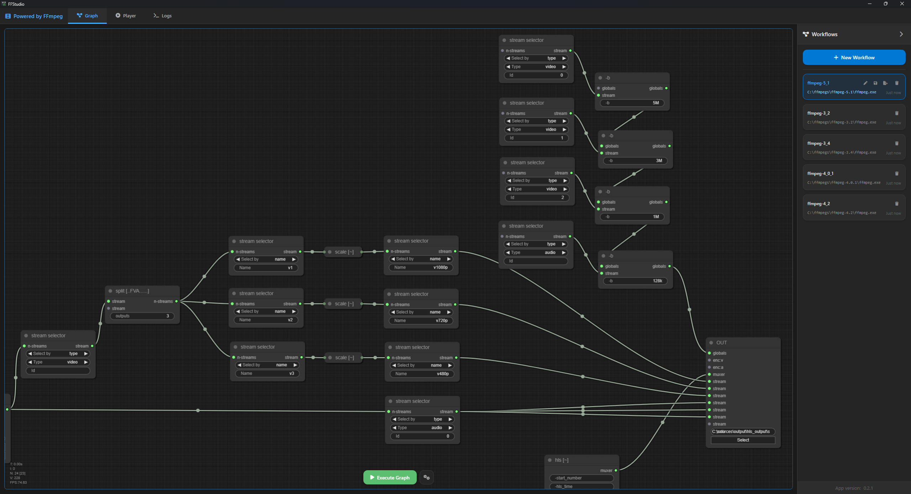

# FFStudio [](https://github.com/Draver93/ff-studio/actions/workflows/windows-build.yml) [](https://github.com/Draver93/ff-studio/actions/workflows/linux-build.yml) [](https://github.com/Draver93/ff-studio/actions/workflows/macos-build.yml)

**FFStudio** is a modern, cross-platform desktop application for visually designing, executing, and managing complex FFmpeg video/audio processing workflows. It provides a graphical interface to build, preview, and run FFmpeg command pipelines using a node-based editor, timeline, and integrated player.



---

## Table of Contents

- [Features](#features)
- [App Overview](#app-overview)
- [User Workflow](#user-workflow)
- [Technology Stack](#technology-stack)
- [Getting Started](#getting-started)
- [Project Structure](#project-structure)
- [License](#license)

---

## Features

- **Visual Workflow Editor:** Drag-and-drop node-based editor using LiteGraph.js to construct FFmpeg processing graphs with automatic node generation from FFmpeg binary.
- **Workflow Management:** Create, edit, save, and delete reusable workflows, each with its own FFmpeg path, environment variables, and description.
- **Undo/Redo:** Per-graph undo/redo history (Ctrl+Z / Ctrl+Y) for safe graph editing.
- **Variables Node:** Define shared variables in one place for consistent graph-wide configuration.
- **Queue System:** Job execution queue with configurable concurrency, stop all, and clear completed controls.
- **Graph Import/Export:** Drag-and-drop `.ffgraph` file import for sharing and backing up workflows.
- **Graph Clipboard:** Copy, cut, and paste nodes within and across graphs.
- **Advanced Player System:** 
  - **Timeline Preview:** Visual timeline with segment management and frame-accurate seeking
  - **Stream Player:** Support for HLS (.m3u8) and DASH (.mpd) streaming protocols with quality selection
  - **Compare View:** Side-by-side video comparison with offset controls and synchronized playback
- **Pro Mode:** Advanced execution pipeline with canvas chain visualization for complex multi-step workflows.
- **Real-time Preview:** Generate preview frames and segments from your workflow graphs with caching system.
- **Execution Logs:** Comprehensive logging system with export functionality for FFmpeg execution, errors, and workflow actions.
- **Cross-Platform:** Built with Tauri 2.0 (Rust + Web), runs on Windows, macOS, and Linux.
- **FFmpeg Integration:** Auto-discovers and parses FFmpeg features, codecs, filters, muxers, demuxers, and options from your installed binary.
- **Environment Variables:** Set custom environment variables per workflow for different FFmpeg configurations.
- **File Server:** Built-in HTTP server for serving media files and previews.
- **Responsive UI:** Modern, responsive interface with collapsible sidebar and tabbed navigation.

---

## App Overview

FFStudio is designed to make advanced FFmpeg usage accessible and visual. Instead of writing complex command lines, users can:

- **Build processing pipelines** by connecting nodes representing inputs, filters, codecs, and outputs.
- **Manage multiple workflows** for different tasks (compression, extraction, conversion, etc.).
- **Preview and fine-tune** segments using a timeline and player.
- **Execute and monitor** FFmpeg jobs with real-time feedback and logs.

### Main UI Areas

- **Top Bar:** App title, tab navigation (Graph, Player, Queue, Logs, Help).
- **Main Area:**
  - **Graph:** Node-based editor for building FFmpeg graphs.
  - **Player:** Video/audio player with timeline and segment controls.
  - **Queue:** Job execution queue with concurrency control, stop all, and clear completed.
  - **Logs:** Execution and debug logs.
  - **Help:** Collapsible help cards for app walkthrough and reference.
- **Right Sidebar:** Workflow management (list, add, edit, delete, select, execute).
- **Modals:** For workflow creation/editing and loading/progress feedback.

---

## User Workflow

1. **Create a Workflow:**
   - Click "New Workflow" in the sidebar.
   - Enter a name, FFmpeg binary path, optional environment variables, and description.
   - FFStudio parses the FFmpeg binary and auto-generates available nodes (filters, codecs, etc.).

2. **Build a Processing Graph:**
   - Drag nodes (inputs, filters, codecs, outputs) onto the canvas.
   - Connect nodes to define the processing pipeline.
   - Configure node properties (e.g., filter parameters, codec options).

3. **Select and Edit Workflows:**
   - Switch between workflows using the sidebar.
   - Edit or delete workflows as needed.

4. **Preview and Edit Segments:**
   - Use the timeline to select, label, and manage video/audio segments.
   - Preview segments in the integrated player.

5. **Execute the Graph:**
   - Click "Execute Graph" to run the FFmpeg pipeline.
   - Monitor progress and logs in real time.
   - Cancel or stop processing if needed.

6. **Review Logs:**
   - View detailed logs for each execution.
   - Export logs for troubleshooting or record-keeping.

---

## Technology Stack

- **Frontend:** 
  - Vanilla JavaScript (ES6 modules)
  - HTML5, CSS3 with custom responsive design
  - [LiteGraph.js](https://github.com/jagenjo/litegraph.js) for node-based graph editor
  - [Video.js](https://videojs.com/) for advanced video playback
  - FontAwesome 6.4.0 for icons
- **Backend:** 
  - [Tauri 2.0](https://tauri.app/) (Rust) with modern plugin system
  - Tauri plugins: file system, dialogs, opener, clipboard
  - Built-in HTTP server for media streaming
  - Process management and FFmpeg execution
- **FFmpeg Integration:** 
  - User-supplied binary with automatic feature discovery
  - Real-time parsing of codecs, filters, muxers, demuxers
  - Environment variable support per workflow
- **Cross-Platform:** Windows, macOS, Linux with native performance

---

## Getting Started

### Prerequisites

- [Rust](https://www.rust-lang.org/tools/install) (latest stable version)
- [Tauri CLI](https://v2.tauri.app/start/prerequisites/) (`cargo install tauri-cli`)
- [FFmpeg](https://ffmpeg.org/) binary installed on your system
- Git (for cloning the repository)

> **Linux:** For video playback in the integrated player, install GStreamer codec plugins:
> ```
> sudo apt-get install gstreamer1.0-plugins-bad gstreamer1.0-libav
> ```

### Installation

1. **Clone the repository:**
   ```sh
   git clone https://github.com/Draver93/ff-studio.git
   cd ff-studio
   ```

2. **Install Rust (if not already installed):**
   ```sh
   curl --proto '=https' --tlsv1.2 -sSf https://sh.rustup.rs | sh
   ```

3. **Run in development mode:**
   ```sh
   cargo tauri dev
   ```
   
4. **Build for production:**
   ```sh
   cargo tauri build
   ```
### 🧩 Troubleshooting

#### Graphical issues on startup

If you experience graphical glitches, black screens, or rendering problems when running **FFStudio**, you can try disabling GPU compositing.

Run the following command before starting the app:

```bash
export WEBKIT_DISABLE_COMPOSITING_MODE=1
./FFStudio
```

This disables GPU acceleration for WebKit and may resolve rendering issues on some systems.

### Usage

- On first launch, create a new workflow and specify your FFmpeg binary path.
- Build your processing graph visually using the node editor.
- Use the timeline and player to preview and fine-tune segments.
- Execute and monitor your workflow with real-time logs.

### Advanced Features

#### Pro Mode
- **Canvas Chain Visualization:** Advanced execution pipeline view for complex multi-step workflows
- **Pipeline Management:** Add, remove, and refresh chain elements
- **Visual Workflow Debugging:** See your entire processing pipeline at a glance

#### Multi-Player System
- **Timeline Preview:** Frame-accurate video preview with segment management
- **Stream Player:** Support for HLS (.m3u8) and DASH (.mpd) streaming protocols
- **Compare View:** Side-by-side video comparison with:
  - Draggable split divider
  - Offset controls for synchronization
  - Global timeline for both videos
  - Quality selection for streams

#### FFmpeg Integration
- **Automatic Discovery:** Parses your FFmpeg binary to discover all available:
  - Codecs (encoders/decoders)
  - Filters (video/audio/subtitle)
  - Muxers and demuxers
  - Global options
- **Dynamic Node Generation:** Creates visual nodes for all discovered FFmpeg features
- **Environment Support:** Per-workflow environment variables for different FFmpeg configurations

#### Built-in Services
- **HTTP File Server:** Built-in server (port 8893) for serving media files and previews
- **Preview Generation:** Automatic generation of preview frames and segments with caching
- **Media Information:** Automatic extraction of media metadata and properties

---

## Project Structure

```
ff-studio/
├── src/                           # Frontend application
│   ├── assets/                    # Screenshots and media assets
│   ├── index.html                 # Main HTML UI with tabbed interface
│   ├── modules/                   # JavaScript modules (ES6)
│   │   ├── main.js                # Application entry point
│   │   ├── core/                  # Core utilities (formatting, etc.)
│   │   │   └── format.js
│   │   ├── graph/                 # Graph editor functionality
│   │   │   ├── clipboard.js
│   │   │   ├── constants.js
│   │   │   ├── core.js            # Core graph operations
│   │   │   ├── execution.js       # Graph execution logic
│   │   │   ├── graph.js
│   │   │   ├── import_export.js
│   │   │   ├── nodes.js           # Node definitions and types
│   │   │   ├── parser.js          # FFmpeg command parsing
│   │   │   ├── undo_redo.js       # Undo/redo history manager
│   │   │   └── utils.js
│   │   ├── help/                  # Help card system
│   │   │   ├── help.js
│   │   │   └── help-cards.html
│   │   ├── logs/                  # Logging system
│   │   │   └── logs.js
│   │   ├── player/                # Media player system
│   │   │   ├── compare-player.js
│   │   │   ├── player.js          # Main player controller
│   │   │   ├── stream-player.js
│   │   │   ├── timeline-player.js
│   │   │   └── timeline.js        # Timeline and segment management
│   │   ├── queue/                 # Job execution queue
│   │   │   ├── constants.js
│   │   │   └── queue.js
│   │   ├── ui/                    # UI components (modals, loading)
│   │   │   ├── loading.js
│   │   │   └── modal.js
│   │   └── workflows/             # Workflow management
│   │       └── workflows.js
│   ├── styles/                    # CSS styling system
│   │   ├── main.css               # Main stylesheet
│   │   ├── animations/
│   │   │   ├── keyframes.css
│   │   │   └── transitions.css
│   │   ├── components/            # Component-specific styles
│   │   │   ├── badges.css
│   │   │   ├── buttons.css
│   │   │   ├── drop-zone.css
│   │   │   ├── exec-bar.css
│   │   │   ├── forms.css
│   │   │   ├── loading.css
│   │   │   ├── modals.css
│   │   │   ├── scrollbars.css
│   │   ├── core/
│   │   │   ├── reset.css
│   │   │   ├── typography.css
│   │   │   ├── utilities.css
│   │   │   └── variables.css
│   │   ├── graph/                 # Graph editor styles
│   │   │   ├── controls.css
│   │   │   ├── graph-zone.css
│   │   │   └── nodes.css
│   │   ├── layout/
│   │   │   ├── app-container.css
│   │   │   ├── main-content.css
│   │   │   ├── side-bar.css
│   │   │   └── top-bar.css
│   │   ├── help/                  # Help card styles
│   │   │   └── help.css
│   │   ├── logs/
│   │   │   └── logs-zone.css
│   │   ├── player/                # Player and timeline styles
│   │   │   ├── compare-player.css
│   │   │   ├── player-zone.css
│   │   │   ├── stream-player.css
│   │   │   ├── timeline-player.css
│   │   │   ├── timeline.css
│   │   │   └── video-controls.css
│   │   ├── queue/                 # Queue zone styles
│   │   │   ├── queue-tab.css
│   │   │   └── queue-zone.css
│   │   ├── responsive/            # Mobile and tablet styles
│   │   │   ├── mobile.css
│   │   │   └── tablet.css
│   │   └── workflows/
│   │       ├── workflow-icons.css
│   │       └── workflow-list.css
│   └── libs/litegraph/            # LiteGraph.js library
├── src-tauri/                     # Rust backend (Tauri 2.0)
│   ├── Cargo.toml                 # Rust dependencies
│   ├── ffstudio.desktop           # Linux desktop entry
│   ├── tauri.conf.json            # Tauri configuration
│   ├── capabilities/
│   ├── gen/
│   ├── icons/                     # Application icons (all platforms)
│   └── src/
│       ├── error.rs
│       ├── lib.rs                 # Library exports
│       ├── main.rs                # Application entry point
│       ├── commands/              # Tauri command handlers
│       │   ├── file_ops.rs        # File operations
│       │   ├── media_ops.rs       # Media information
│       │   ├── mod.rs
│       │   └── workflow_ops.rs    # Workflow management
│       ├── ffmpeg/                # FFmpeg integration
│       │   ├── executor.rs        # FFmpeg execution
│       │   ├── mod.rs
│       │   ├── parser.rs          # FFmpeg feature parsing
│       │   └── version.rs         # Version detection
│       ├── server/                # HTTP server for media streaming
│       │   ├── file_server.rs
│       │   └── mod.rs
│       ├── utils/                 # Utility functions
│       │   ├── filesystem.rs
│       │   ├── hash.rs
│       │   ├── mod.rs
│       │   └── version.rs
│       └── workflow/              # Workflow data structures
│           ├── manager.rs
│           ├── mod.rs
│           └── types.rs
├── LICENSE                        # License file
└── README.md                      # This file
```

---

## License

FFStudio is licensed under the **GNU General Public License v3.0**.  

This is free software: you can redistribute it and/or modify it under the terms of the GNU General Public License as published by the Free Software Foundation, either version 3 of the License, or (at your option) any later version.

For full license details, see [LICENSE](./LICENSE).

---

## Detailed App Description

**FFStudio** is a visual FFmpeg workflow designer and executor. It bridges the gap between FFmpeg’s powerful but complex CLI and the needs of video/audio professionals, educators, and hobbyists who want to automate and experiment with media processing.

### Key Concepts

- **Workflows:** Named, reusable sets of FFmpeg processing steps, each with its own configuration and environment.
- **Node Graph:** Each workflow is a directed graph of nodes (inputs, filters, codecs, outputs) representing FFmpeg operations.
- **Variables:** Define shared values in a single node for consistent graph-wide configuration.
- **Undo/Redo:** Per-graph history with debounced snapshots and keyboard shortcuts.
- **Queue:** Job execution queue with configurable concurrency for batch processing.
- **Timeline:** Lets users select, label, and manage time-based segments for precise editing and preview.
- **Player:** Integrated video/audio player for instant feedback.
- **Logs:** All actions and FFmpeg output are logged for transparency and debugging.

---

### ⚠️ FFmpeg Usage & License

This project does **not** bundle or link FFmpeg — it simply invokes a user-supplied FFmpeg binary via subprocess.

FFmpeg is licensed under **LGPL v2.1+**, though some optional parts are under **GPL v2+**. 
Because we don’t distribute or modify FFmpeg, its licensing obligations don’t apply to our own code.

For more about FFmpeg’s licensing, see: [ffmpeg.org/legal.html](https://ffmpeg.org/legal.html)  
